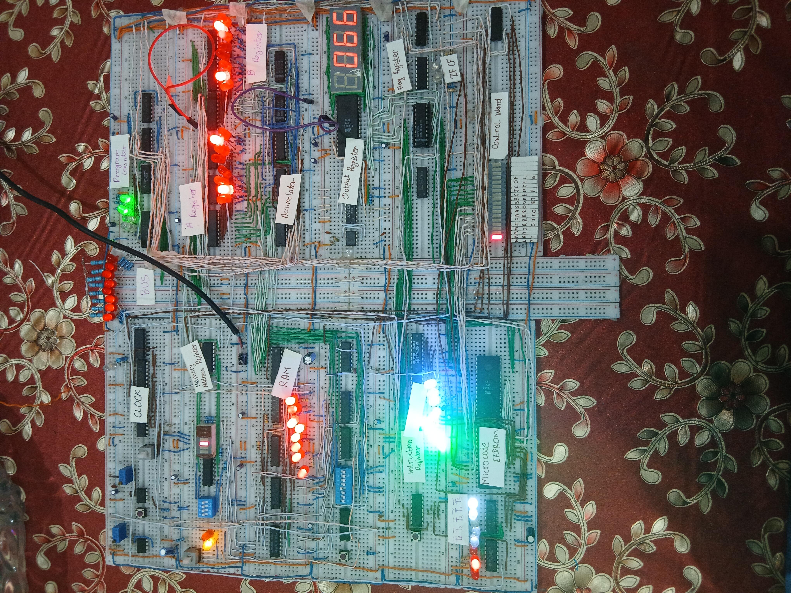

# 8-bit Breadboard Computer (Ben Eater SAP-1)

A fully functional 8-bit computer built from TTL logic chips on breadboards, inspired by Ben Eater's SAP-1 design during my gap holidays before starting my universityo[.

## 🧠 Features
- Manual clock and control unit
- 8-bit ALU, registers, and program counter
- Executes basic machine instructions (FETCH,HLT,ADD,OUT,SUB,STA,LDI,JMP,JC,JZ)
- Built entirely from 74LS series ICs
- Took more than 50 ICs and ROMs
- Took me about 2.5 month and i built it during my gap holidays before starting my university

## 🛠️ Components Used
- 74LS173, 74LS245, 74LS161, 74LS00, 74LS08, 74LS32, 74LS04,74LS02,74LS86,74LS138,74LS139,74LS157,74LS189,74LS273,74LS00,74LS107,74LS283,28C256,555TIMER,74LS161 etc.
- LEDs, resistors, clock circuit,dip switches,capacitors and push buttons

## 💻Programs
- In Sap1Program.asm file there is a unique bonus program that i couldnt find anywhere else on internet. It calculate greatest of two number. 
[click here to see greaterNumber program](Sap1Programs.asm)

## Instruction Sets
- Here are all the instruction sets that this computer can execute

## 📷 Gallery
- In photos folder you can see a bunch of photos of Sap 1

## 🧩 Skills Learned
- Digital logic design
- Instruction cycles and timing
- Hardware debugging and circuit reliability
- Deep understanding of how CPUs execute instructions

## 📍 About
Built during my day holidays before starting my CS to understand how a CPU works from the ground up.
